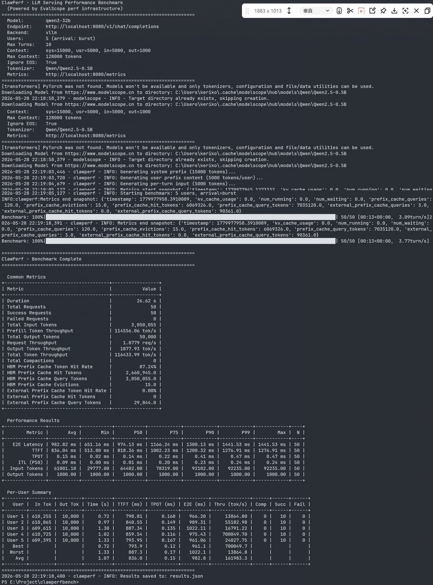

# ClawPerfBench

Performance benchmarking tool for LLM Serving backends with multi-turn long-context workloads.

[中文文档](README_CN.md)

Built on [EvalScope](https://github.com/modelscope/evalscope)'s perf infrastructure, adding:

- **Multi-turn context model**: System Prefix + User Prefix + History + Current Input
- **Append-mode compaction**: Clear history, grow user prefix when context reaches limits
- **User arrival scheduling**: Burst, steady, or Poisson arrival patterns
- **System metrics polling**: Prometheus endpoint support for vLLM, SGLang, MindIE
- **Per-user + per-turn metrics**: TTFT, TPOT, ITL with compaction tracking
- **Prefix cache simulation**: Trie-based HBM + external prefix cache hit rate tracking in mock server



## Installation

```bash
pip install clawperf
```

For the mock server used in testing:

```bash
pip install clawperf[mock-server]
```

For development:

```bash
pip install clawperf[dev]
```

Install from source (recommended for development):

```bash
git clone https://github.com/Potterluo/ClawPerf.git
cd ClawPerf
uv sync --extra dev --extra mock-server
```

## Quick Start

### Run a benchmark

```bash
clawperf \
  --endpoint http://localhost:8000/v1/chat/completions \
  --model qwen3-32b \
  --num-users 5 \
  --user-arrival steady:2 \
  --max-turns 10 \
  --output results.json
```

### Start mock server (for testing)

```bash
clawperf-mock-server --port 8080
```

### End-to-end test with mock server

```bash
# Start mock server
clawperf-mock-server --port 8080

# Run benchmark against it
clawperf \
  --endpoint http://localhost:8080/v1/chat/completions \
  --model Qwen/Qwen2.5-7B-Instruct \
  --tokenizer Qwen/Qwen2.5-7B-Instruct \
  --num-users 4 \
  --max-turns 5 \
  --max-context-tokens 200000 \
  --metrics-endpoint http://localhost:8080/metrics \
  --backend vllm \
  --verbose
```

## CLI Options

### User Configuration

| Option | Default | Description |
|--------|---------|-------------|
| `--num-users` | 1 | Total concurrent users |
| `--user-arrival` | burst | Arrival pattern: `burst`, `steady:<seconds>`, or `poisson:<lambda>` |

### Context Configuration

| Option | Default | Description |
|--------|---------|-------------|
| `--system-prefix-tokens` | 15000 | System prefix token count |
| `--system-prefix-source` | random | Source: `random` or a file path |
| `--user-prefix-tokens` | 5000 | Per-user prefix token count |
| `--input-tokens-per-turn` | 5000 | Input tokens per turn |
| `--output-tokens-per-turn` | 1000 | Output tokens per turn |
| `--max-context-tokens` | 128000 | Context window limit |
| `--compaction-prefix-increment` | 5000 | User prefix growth on compaction |

### Run Configuration

| Option | Default | Description |
|--------|---------|-------------|
| `--max-turns` | 100 | Maximum turns per user |

### API Configuration

| Option | Default | Description |
|--------|---------|-------------|
| `--endpoint` | (required) | LLM API endpoint URL |
| `--model` | (required) | Model name |
| `--api-key` | (empty) | API key |
| `--tokenizer` | (defaults to model) | Tokenizer path |
| `--ignore-eos` | True | Ignore EOS token |
| `--request-timeout` | 600 | Request timeout in seconds |

### System Metrics

| Option | Default | Description |
|--------|---------|-------------|
| `--metrics-endpoint` | None | Prometheus metrics URL |
| `--metrics-interval` | 5 | Polling interval in seconds |
| `--backend` | vllm | Backend: `vllm`, `sglang`, or `mindie` |

### Output

| Option | Default | Description |
|--------|---------|-------------|
| `--output` | results.json | Output JSON file path |

## Output Format

Results are saved as JSON with:

```json
{
  "config": { ... },
  "summary": {
    "prefix_cache_token_hit_rate": 0.7981,
    "prefix_cache_hit_tokens_delta": 712012,
    "prefix_cache_query_tokens_delta": 892165,
    "total_compactions": 0,
    ...
  },
  "users": [
    {
      "user_id": 0,
      "aggregate": {
        "total_output_tokens": 3000,
        "ttft": { "avg": 150.2, "P50": 140, "P99": 200 },
        "tpot": { "avg": 3.2, "P50": 3.0, "P99": 5.0 },
        "throughput_tok_s": 12.5,
        "error_count": 0,
        "compaction_count": 2
      },
      "turns": [
        {
          "turn_id": 1,
          "success": true,
          "ttft_ms": 150.2,
          "e2e_latency_ms": 3200.5,
          "tpot_ms": 3.2,
          "input_tokens": 25000,
          "output_tokens": 1000,
          "context_tokens": 25000,
          "compaction_triggered": false
        }
      ]
    }
  ],
  "system_metrics": [ ... ],
  "timeline": [ ... ]
}
```

## Testing Philosophy

ClawPerfBench is designed to simulate the **real workload of an Agent system** — not single-shot API calls, but sustained multi-turn conversations that push LLM serving backends to their limits.

### Why multi-turn matters

Real Agent systems (like OpenClaw) don't send one-off requests. They maintain long conversations: a system prompt, user-specific context, and growing history. Each turn re-sends the entire accumulated context, creating exponentially growing prompts. This is fundamentally different from single-request benchmarks and exposes backend behaviors that single-shot tests miss:

- **Prefix cache effectiveness**: Does the KV-block cache actually reuse tokens across turns? A single-request benchmark can't measure this.
- **Compaction under load**: When context hits the window limit, how does the system handle truncation? Does it recover gracefully or spiral into overflow?
- **Latency degradation**: As context grows from 25K to 200K tokens, TTFT and TPOT change dramatically. Per-turn metrics reveal this progression.
- **Concurrent pressure**: Multiple users with independent conversations create mixed prefix cache states — some sharing the system prefix, others diverging at user-specific paths.

### Simulating real users

Each simulated user maintains an independent conversation state with its own growing prefix and history. Users arrive according to configurable patterns (burst, steady, Poisson) — mimicking how real traffic builds up, not an artificial flood of identical requests.

### What we measure

| What | Why it matters |
|------|---------------|
| TTFT per turn | First-token latency grows with context size — the key UX metric for Agent systems |
| TPOT per turn | Generation speed should stay stable; degradation indicates compute bottlenecks |
| Prefix cache hit rate | Token-level reuse fraction across turns — the efficiency metric for KV caching |
| Compaction events | When and how often context overflows — determines conversation continuity |
| Per-user breakdown | Different users have different prefix paths; aggregate stats hide per-user variance |

## Context Model

Each user's context follows this structure:

```
[System Prefix] [User Prefix] [History] [Current Input]
```

When context reaches `--max-context-tokens`, append-mode compaction fires:

1. The base context (system + user prefix + input, without history) is checked first. If it already exceeds the limit, compaction is skipped and the turn is marked as `context_overflow` — this prevents infinite compaction loops.
2. Otherwise, history is cleared and the user prefix grows by `--compaction-prefix-increment` tokens.
3. New random content fills the enlarged user prefix.

This simulates how real LLM serving systems handle context overflow with prefix caching.

## Prefix Cache Simulation

The mock server simulates vLLM's KV-block prefix cache using a trie:

- **HBM trie**: Represents GPU KV cache. Queried first for longest prefix match. Always updated after every request (mimicking vLLM storing all KV blocks regardless of hit/miss).
- **External trie**: Represents CPU/disk prefix cache. Queried on HBM miss. Also always updated after every request.
- **Token-level hit rate**: `prefix_cache_hit_tokens / prefix_cache_query_tokens` — the fraction of prompt tokens that reuse cached KV blocks. This is the meaningful metric; request-level (binary) hit rate is not reported.
- **Eviction**: When the trie exceeds `max_prefixes` (200), oldest leaf nodes are evicted.

## User Arrival Scheduling

- **burst**: All users start immediately
- **steady:2**: Users arrive every 2 seconds
- **poisson:0.5**: Users arrive following a Poisson process with rate 0.5

## Architecture

ClawPerf reuses EvalScope's core perf components:

- **AioHttpClient**: Async HTTP with streaming, proper timeout/connector config
- **OpenaiPlugin**: Request building, response parsing, local token counting
- **BenchmarkData**: Single-request data container (TTFT, ITL, E2E timing)
- **MetricsAccumulator**: Real-time metrics aggregation

And adds its own orchestration layer for multi-turn, multi-user workloads.

Key modules:

| Module | Role |
|--------|------|
| `cli.py` | Argparse entry point, config creation, runner launch |
| `config.py` | `BenchmarkConfig` dataclass, arrival mode parsing |
| `runner.py` | `BenchmarkRunner` orchestrator, user loop, result finalization |
| `context.py` | `UserContext` context assembly, compaction with infinite-loop guard |
| `scheduler.py` | Burst/steady/Poisson async generators |
| `system_metrics.py` | `SystemMetricsPoller` with backend-specific metric mappings |
| `tokenizer.py` | `TokenizerManager` wrapping ModelScope/HuggingFace tokenizers |
| `mock_server.py` | FastAPI mock LLM server with trie-based prefix cache simulation |

## Development

```bash
uv sync --extra dev --extra mock-server
pytest
ruff check
```

## License

Apache License 2.0